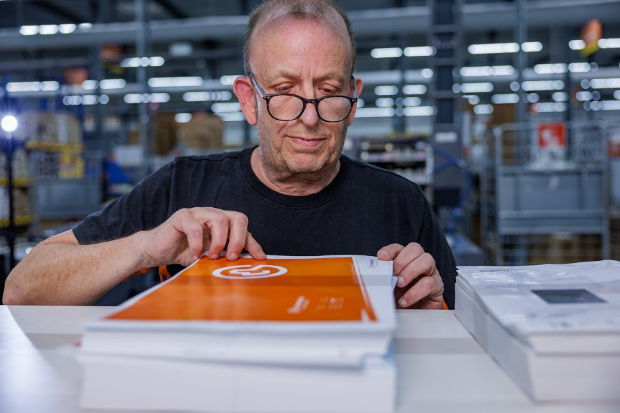

De instructies voor deze opdracht staan in: [INSTRUCTIONS.md](https://github.com/fdnd-task/the-startup-responsive-interactieve-website/blob/main/docs/INSTRUCTIONS.md)

# Vernieuwde carrière pagina _Drukwerkdeal_

## Inhoudsopgave
* [Inleiding](#inleiding)
* [Beschrijving](#beschrijving)
* [Kenmerken](#kenmerken)
* [Bronnen](#bronnen)
* [Licentie](#licentie)

## Inleiding
### About _[Drukwerdeal](https://www.drukwerkdeal.nl/)_
Drukwerkdeal is de grootste online drukkerij van de Benelux. Klanten kunnen op een toegankelijke en gemakkelijke manier (online) drukwerk bestellen van de beste kwaliteit. 

### Uitdaging
Drukwerkdeal wil nieuwe werknemers aanspreken op een manier die bij het bedrijf past, maar de UX op de huidige carrière pagina is niet voldoende engaging en reflecteert de nieuwe huisstijl niet. De opdracht is dus om de huidige pagina te herontwerpen volgens de nieuwe huisstijl.

### Oplossing
De oplossing bevat een herontwerp van de pagina in de huisstijl van Drukwerkdeal. Hierbij is gewerkt vanuit een mobile first principe en rekening gehouden met toegankelijkheid. Voor meer toelichting hierover, bekijk [beschrijving](#beschrijving).

Bekijk [hier](https://julia-stevens.github.io/the-startup-responsive-interactive-website/) de live website. 

https://github.com/user-attachments/assets/bf4f5095-43e9-4816-bf27-9b719c40a05c

https://github.com/user-attachments/assets/b9c3003a-54be-47e6-b643-fac528148ffc

## Beschrijving 
Op de vernieuwde carrière pagina, krijgen potentiële werknemers een eerste indruk van het bedrijf Drukwerkdeal. Naast tekst en uitleg over het bedrijf, wordt op de pagina ook aan de hand van afbeeldingen een beeld van Drukwerkdeal geschetst. De lijst van vacatures kan worden gefilterd en tot slot kunnen bezoekers van de site zich ook aanmelden voor een job alert. 

### Responsive 
De website is gebouwd vanuit het mobile first principe. Onderstaande afbeelding laat de verschillende layouts en breakpoints zien. 
Op xxs-formaat is er een one column layout en staan de meeste items onder elkaar geplaatst. Bij xs-formaat zijn items, zoals de in de navigatie, naast elkaar geplaatst. Bij het s-formaat gaat dit verder, waar ruimte worden items zoveel mogelijk naast elkaar geplaatst, bijvoorbeeld de gehele navigatie (logo en links). Op het m-formaat wordt de horizontale ruimte verder benut. De labels van de navigatie items worden hier bijvoorbeeld naast het icoon weergegeven in plaats van er onder. En op l-formaat geldt er een `max-width` voor de meeste elementen en wordt de witruimte opgevuld met visuele elementen (zoals het inktpatroon van Drukwerkdeal bij de header).


_De carrière pagina bestaat uit 5 layouts: xxs, xs, s, m en l_

### Ontwerpkeuzes
De opdrachtgever heeft recent een nieuwe huisstijl ontworpen en dit doorgevoerd op de hele website. Mijn uitdaging was om deze huisstijl door te voeren op de carrière pagina. Dit heb ik gedaan door het [design system van Drukwerkdeal](#bronnen) aan te houden en te verwerken in verschillende elementen op de pagina. Zie onderstaande voorbeelden. 

#### Ronde borders, met één rechte hoek 
Drukwerkdeal maakt veel gebruik van het inkt icoon met volledige ronde border en één rechte hoek. Dit patroon heb ik doorgevoerd ik veel verschillende elementen: 

**Knoppen**


**Vacatures**


**Secties**


#### Kleur
In de huisstijl van Drukwerkdeal staat de kenmerkende oranje kleur centraal. Verder is het kleurgebruik erg rustig met een lichte grijs, veel wit en zwarte tekst. De oranje kleur komt dus veel terug in mijn herontwerp. Voor verschillende secties heb ik gebruik gemaakt van de light grijze kleur, deze kleur wordt namelijk op de hele website van Drukwerkdeal gebruikt om verschillende secties uit te lichten. Dit heb ik bijvoorbeeld gedaan bij het sign up formulier. 


**Contrast**

Om voor voldoende kleur contrast te zorgen, heb ik een aantal keuzes gemaakt. 

De titel van de vacatures donkerder dan het oorspronkelijke oranje: 


De tekst bij de quote is zwart, in plaats van het oorspronkelijke wit: 


#### Belangrijkste features
**Filter-knop interactie**

Op de carrière pagina staat een behoorlijke lijst met vacatures. Als gebruiker is het dus prettig om de mogelijkheid te hebben deze lijst te filteren, om zo de relevante vacatures te bekijken. Ik heb ervoor gekozen om het daadwerkelijke filter te verbergen onder een knop. Bij een klik op de knop wordt het menu, met een animatie geopend. 

De oranje knop geeft duidelijk feedforward aan de gebruiker, door middel van tekst: 'Filter de vacatures'. Ook verandert de knop van kleur wanneer er over gehoverd wordt (feedforward). Bij een klik op de knop gebeuren er verschillende dingen: het menu klapt uit, eerst over de lengte en daarna naar beneden. Vervolgens komen de filter knoppen 'naar beneden vallen'. Hiermee wordt duidelijke feedback gegeven aan de gebruiker, dat de klik op de knop succesvol was. Na het uitklappen van het menu, verandert het filter icoon in een kruis en wordt er een label bij het kruis toegevoegd, namelijk: 'Sluit'. Hiermee wordt wederom duidelijk feedforward gegeven aan de gebruiker, namelijk bij een klik op het sluit icoon, zal het menu sluiten. Hierin heb ik wederom gebruik gemaakt van een hover-state, om extra feedforward te geven dat er een actie zal plaatsvinden bij een klik op de sluit-knop. 
De filter-knoppen in het menu bevatten allemaal een duidelijk label, namelijk: Afdeling, Plaats en Vacature type. Ook bevatten ze een hover-state. Hiermee wordt feedforward gegeven, dat bij een klik op deze knoppen de lijst met de vacatures wordt gefilterd op basis van het label van de knop. Bij een klik op de knop, verandert de achtergrond kleur van de knop en hiermee wordt feedback gegeven, dat de geklikte filter-knop nu actief is. Daarnaast blijft de tekst 'Filter de vacatures' in beeld, zodat er duidelijke feedforward is, dat deze filter-knoppen de vacatures zullen filteren. 
Tot slot, na het klikken op de sluit-knop, wordt wederom een animatie gestart: de knoppen verdwijnen omhoog en het menu klapt zich terug in naar het oorspronkelijke formaat. Hiermee wordt weer duidelijk feedback gegeven dat de klik op de sluit-knop succesvol was. 

https://github.com/user-attachments/assets/54f47515-992a-4ea5-8bd3-c4363fc50cb3

**Disney animatie principes**

In de animatie van deze interactie, komen _timing_ en _staging_ van de Disney animatie principes naar voren. Timing, omdat er verschillende keyframes worden aangeroepen, waarbij een specifieke volgorde wordt aangehouden om het juiste effect te creëeren. Staging komt terug bij de filter knoppen die naar beneden komen vallen met een `cubic-bezier`. 

**User tests**

Deze interactie is getest met verschillende gebruikers. Aan de hand van de bevindingen blijkt het eenvoudig om de filter-knop te vinden en te gebruiken. Ook de `sticky` positie is prettig, zodat je als gebruiker het filter kan aanpassen, ook wanneer je door de lijst aan het scrollen bent. Op basis van de tests heb ik ook een aantal aanpassingen gemaakt, namelijk een duidelijkere hover-state over het geactiveerde filter (zie video). 

## Kenmerken 
### HTML
De pagina is bestaat uit o.a. een `header`, `nav` en verschillende `section`s, zoals voor de vacatures, het inschrijf formulier en de quote. De vacatures zijn op zichzelf ook een `section` met daarin een `article`. 

```html
<section class="vacancy">
    <h3>Customer Care</h3>
    <article class="vacancy-content">
        <a href="" class="vacancy-content-a">
            <div class="vacancy-content-text">
                <h4>Customer Care Specialist</h4>
                <p>Fulltime / Parttime</p>
                <p>Drukwerkdeal, Deventer</p>
            </div>

            <div class="vacancy-image">
                
            </div>
        </a>
    </article>
</section>
```

### CSS
Ik heb gewerkt met 2 stylesheets. Eén met daarin custom properties en classes met daarin de huisstijl van Drukwerkdeal. En de ander bevat alle styling en layout voor de pagina. 

Aan de hand van verschillende classes en keyframes is bijvoorbeeld de filter animatie gebouwd. Zie bijvoorbeeld hoe de achtergrond van het filter-menu. Deze class (`openMenu`) wordt in JavaScript getoggled door een klik op de knop. 

```css
&.openMenu {
    animation: toTheRight .2s ease-in, .2s toTheBottomSmall .2s ease-in;
    animation-fill-mode: forwards;

    @media (min-width: 425px) {
        animation: toTheRight .2s ease-in, .2s toTheBottom .2s ease-in;
        animation-fill-mode: forwards;
        max-width: 1068px;
    }
}

@keyframes toTheRight {
    0% {
        width: 0%;
    }
    100% {
        width: 100%;
    }
}
```

### JavaScript
In JS worden o.a. de verschillende classes met de keyframes voor de filter animatie getoggled met door een klik-event. 

De functie `filterBackgroundAnimation` wordt aangeroepen bij een klik op de filter-knop. In deze functie wordt gecheckt of het element met de achtergrond al de class `openMenu` bevat, zo ja: dan wordt de class voor de sluit animatie toegevoegd (en `openMenu` verwijderd). Zo nee: dan wordt de class `openMenu` toegevoegd en de class `closeMenu` verwijderd. 

```js
function filterBackgroundAnimation() {
    if (filterBg.classList.contains("openMenu")) {
        filterBg.classList.add("closeMenu");
        filterBg.classList.remove("openMenu");
    } else {
        filterBg.classList.add("openMenu");
        filterBg.classList.remove("closeMenu");
    }
}
```

### Code conventions
#### Ademruimte en inspringen in HTML
* Inspringen altijd met een tab, zie [voorbeeld](https://github.com/julia-stevens/the-startup-responsive-interactive-website/blob/d65206fb5a9bef7a9d5c0a9ee8f50549df385da0/index.html#L107-L124)
* Inline elementen op dezelfde regel, zie [voorbeeld](https://github.com/julia-stevens/the-startup-responsive-interactive-website/blob/d65206fb5a9bef7a9d5c0a9ee8f50549df385da0/index.html#L39-L54)
* Block elementen op aparte regels, zie [voorbeeld](https://github.com/julia-stevens/the-startup-responsive-interactive-website/blob/d65206fb5a9bef7a9d5c0a9ee8f50549df385da0/index.html#L431-L434)

#### Volgorde en nesten van CSS selectors
* CSS gestructureerd op volgorde van HTML. Dus: start met `header`, daarna `nav`, etc. Zie [voorbeeld](https://github.com/julia-stevens/the-startup-responsive-interactive-website/blob/ae04b5e13ff5ced125c26bf9f8b5cd8961363782/styles/style.css#L1)
* Alle genesten elementen in HTML, zijn ook in CSS genest (onder de betreffende `section` `div` of `header` `nav` `footer`, etc.) en in volgorde van HTML [Zie bijvoorbeeld de nesting van de `section` 'vacancies'](https://github.com/julia-stevens/the-startup-responsive-interactive-website/blob/51f1fccf67c80d8f35924d63a797c3c654ac0434/styles/style.css#L393-L683)

#### Nesten van media queries
* Alle media queries zijn genest in de betreffende CSS selectoren, zie [voorbeeld](https://github.com/julia-stevens/the-startup-responsive-interactive-website/blob/ae04b5e13ff5ced125c26bf9f8b5cd8961363782/styles/style.css#L1-L19)
* De media queries staan onderaan in de styling van de betreffende selector. In dit [voorbeeld](https://github.com/julia-stevens/the-startup-responsive-interactive-website/blob/ae04b5e13ff5ced125c26bf9f8b5cd8961363782/styles/style.css#L21-L40) staat de media query dus onderaan de algemene styling van de `nav`, daarna volgen de genesten selectoren. 

#### Naamgeving
* Kebab-casing in HTML en CSS, zie [voorbeeld](https://github.com/julia-stevens/the-startup-responsive-interactive-website/blob/9a30182f18ccecb6b1a8aa75443a3f05bc151d6d/styles/stylesheet.css#L61-L64)
* CamelCase in JS met een beschrijvende naam voor de variabelen. Zie [voorbeeld](https://github.com/julia-stevens/the-startup-responsive-interactive-website/blob/f82baa1e0b1a3a04611fd139ed3aee0423a79acf/scripts/script.js#L1-L12)
* Naamgeving classes beschrijven (informatie) inhoud van betreffende sectie, zie [voorbeeld](https://github.com/julia-stevens/the-startup-responsive-interactive-website/blob/f82baa1e0b1a3a04611fd139ed3aee0423a79acf/index.html#L128). De class heet hier 'vacancy' en beschrijft hiermee de inhoud van deze sectie, namelijk een vacature
* Naamgeving custom properties overgenomen vanuit [styleguide Drukwerkdeal](https://styleguide.printdeal.cloud/packages/ui-library/6.7.2/?path=/docs/fundamentals-colors--docs), zie [stylesheet](https://github.com/julia-stevens/the-startup-responsive-interactive-website/blob/f82baa1e0b1a3a04611fd139ed3aee0423a79acf/styles/stylesheet.css#L35-L58)

## Bronnen
* [The Printdeal Design System](https://styleguide.printdeal.cloud/packages/ui-library/6.7.2/?path=/docs/introduction--docs)

## Licentie
This project is licensed under the terms of the [MIT license](./LICENSE).
